# 🔒 HUSHBOX - Your Digital Privacy Vault  


HUSHBOX is a next-generation, privacy-first communication tool that redefines secure messaging. By combining military-grade encryption with QR code technology, HUSHBOX enables users to exchange confidential messages without ever relying on external servers.

Unlike traditional platforms, all encryption and decryption occur locally on your device, ensuring your data remains completely under your control. Messages are never stored, logged, or transmitted through third-party infrastructure. Instead, encrypted QR codes can be shared via any medium, while your passphrase remains separate—ensuring maximum security even if the message is intercepted.

🔐 **Zero-Server Architecture** – Messages never touch external servers

🕵️ **Ephemeral Design** – No tracking, no storage, no metadata

🔓 **Open Source** – Transparent and auditable security

📱 **PWA Ready** – Install as a lightweight progressive web app

📴 **Offline Functionality** – Works seamlessly without internet access

**Perfect For**:  
🔏 Privacy-conscious individuals | 🏢 Enterprises handling sensitive data | 💼 Legal/medical professionals | 🛡️ Security researchers | ✈️ Travelers in high-risk areas  

---

## 🚀 Key Features

|       **Category**       |        **Key Features**                                                                   |
|--------------------------|-------------------------------------------------------------------------------------------|
| 🔐 **Core Security**     | - AES-256-GCM encryption with HMAC integrity protection <br> - PBKDF2 key derivation (310,000 iterations) <br> - Compressed payloads for efficient QR encoding <br> - Anti-brute force protection (5 attempts limit) |
| 📱 **User Experience**   | - Responsive design with mobile-first approach <br> - Real-time passphrase strength indicators <br> - Animated QR codes with custom branding <br> - Camera QR scanning <br> - Social media integration for secure sharing |
| 🛡️ **Advanced Protections** | - IV time-stamping for replay attack prevention <br> - Memory sanitization after operations <br> - Secure content disposal <br> - Tamper-evident payload design|

---

## ⚙️ Technical Stack
### Frontend Architecture  
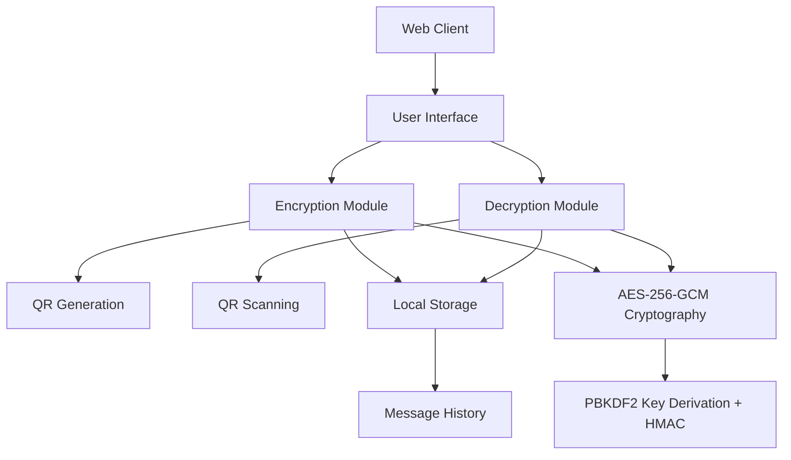
### Encryption flow
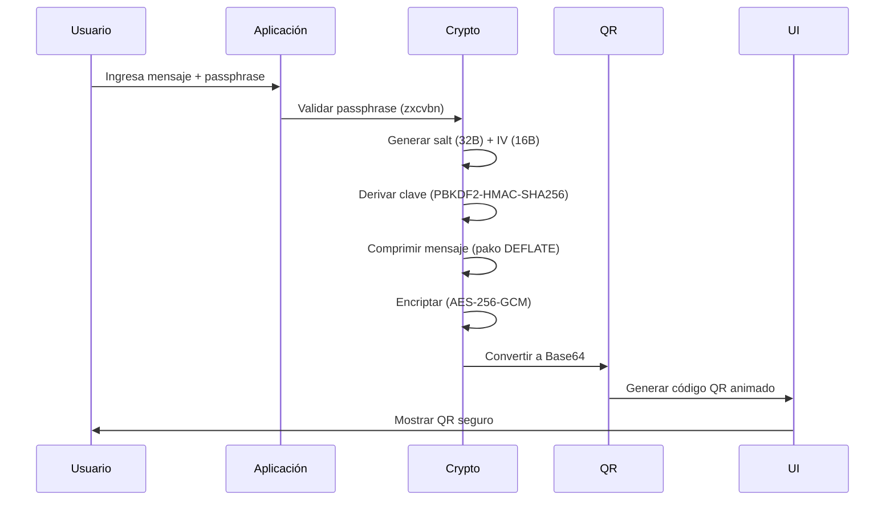
### Decryption flow
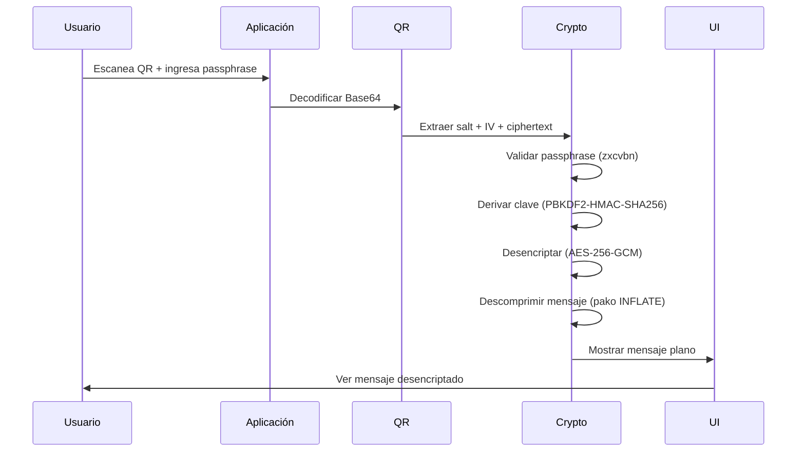


### Dependencies  
| Library | Version | Purpose | SRI Hash |
|---------|---------|---------|----------|
| **pako**     | 2.1.0   | Compression DEFLATE           | `sha256-7eJpOkpqUSa501ZpBis1jsq2rnubhqHPMC/rRahRSQc=` |
| **qrcode**   | 1.5.1   | QR Generation                 | `sha256-7GTYmrMJbc6AhJEt7f+fLKWuZBRNDKzUoILCk9XQa1k=` |
| **jsqr**     | 1.4.0   | QR Decoding                   | `sha256-TnzVZFlCkL9D75PtJfOP7JASQkdCGD+pc60Lus+IrjA=` |
| **jspdf**    | 2.5.1   | PDF export                    | `sha256-mMzxeqEMILsTAXYmGPzJtqs6Tn8mtgcdZNC0EVTfOHU=` |
| **zxcvbn**   | 4.4.2   | Passphrase validation         | `sha256-9CxlH0BQastrZiSQ8zjdR6WVHTMSA5xKuP5QkEhPNRo=` |
- **UI Framework**: Pure CSS Grid/Flex
- **Icons**: Font Awesome 6

---

## 🛠️ Installation & Usage  

### Project Structure
```bash
HUSHBOX/
├── index.html          
├── script.js           
├── styles.css          
├── manifest.json       
├── favicon.ico
├── manifest.json
├── sitemap.xml
├── assets/                 
│   └──  favicon.png
├── legal/                
│   └── LICENSE.md
│   └── privacy-police.md
│   └── terms-of-service.md
├── LICENSE
└── README.md        
```
### Local Deployment
```bash
git clone https://github.com/MPetovick/HUSHBOX.git
cd HUSHBOX
# Serve using local web server
python3 -m http.server 8000
```
Open `http://localhost:8000` in modern browser or just click index.html

### Web Version  
[https://www.hushbox.online](https://mpetovick.github.io/HUSHBOX)


### User manual
1. Visit **[hushbox.online](https://www.hushbox.online)**  
2. **Encrypt a message**:  
   - Enter passphrase (12+ characters)  
   - Type your secret message  
   - Click "Encrypt"  
   - Share the generated QR via any channel  
3. **Decrypt a message**:  
   - Scan/upload a QR code  
   - Enter the passphrase (shared separately)  
   - Click "Decrypt"  
---

## 🔄 Workflow Diagram

**Backup Workflow:**
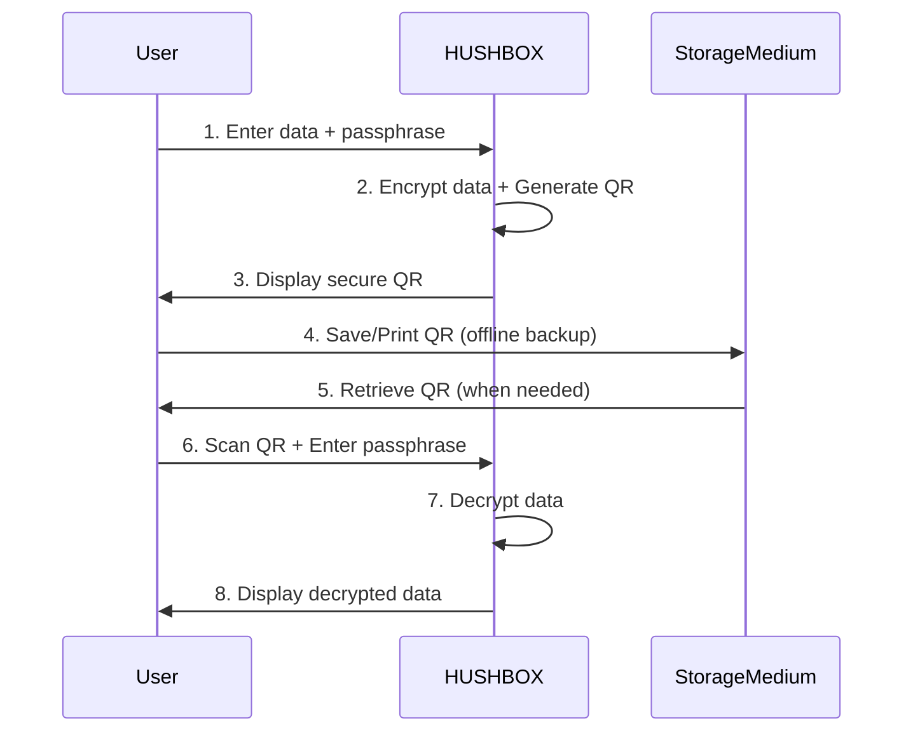
**Offline Workflow:**
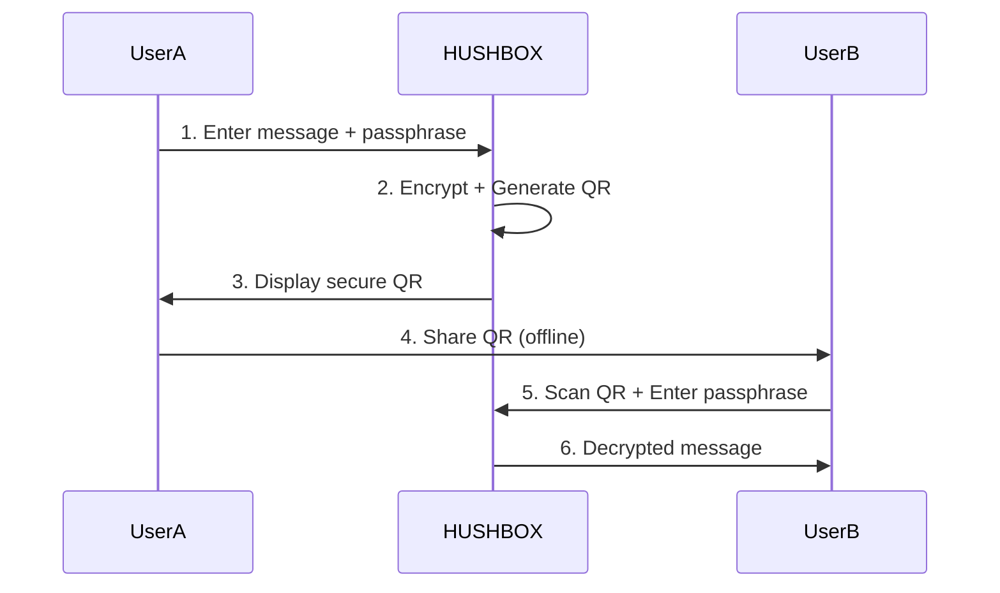
**Online Workflow:**

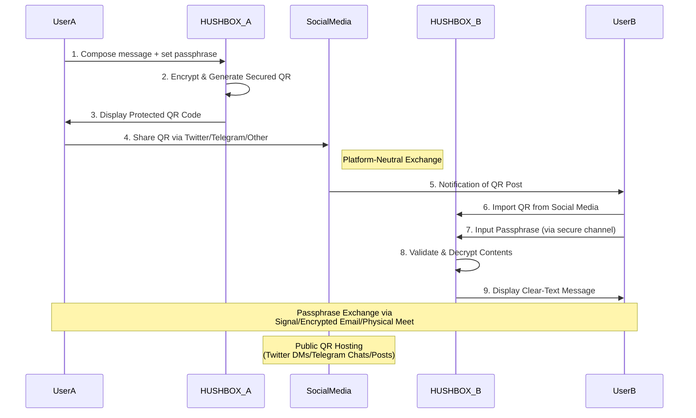

### Examples

### ₿ Crypto Wallet Seed Backup
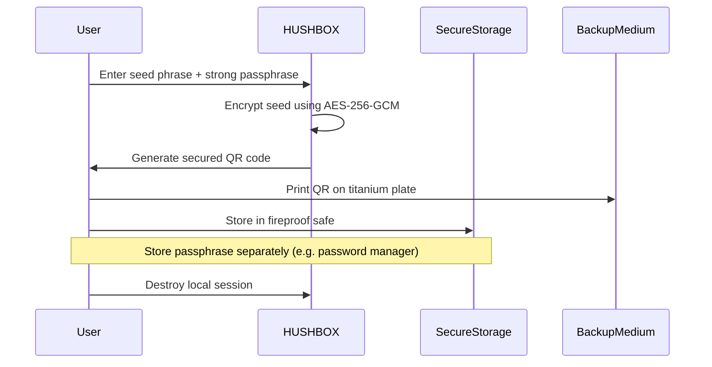
***Security Features for Crypto Seeds***
- **Multi-Location Storage**: QR physical backup + digital passphrase
- **Redundancy**: Create multiple QR backups for different locations
- **Tamper Evidence**: QR contains HMAC signature to detect alterations
- **Time-Lock**: Optional delayed decryption feature
- **Plausible Deniability**: Seed appears as random data in QR

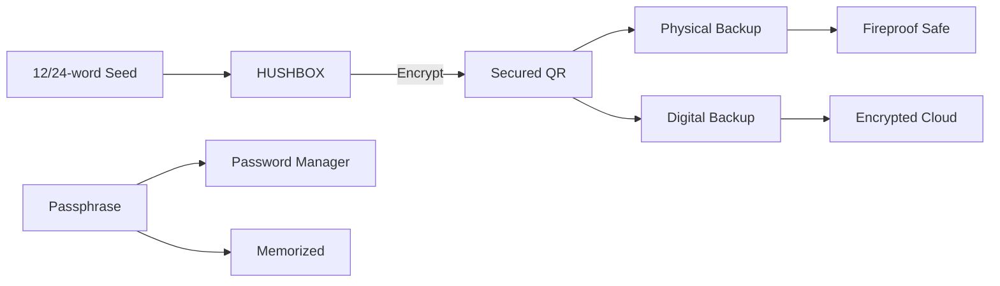

### 🏥 Medical Records Transfer

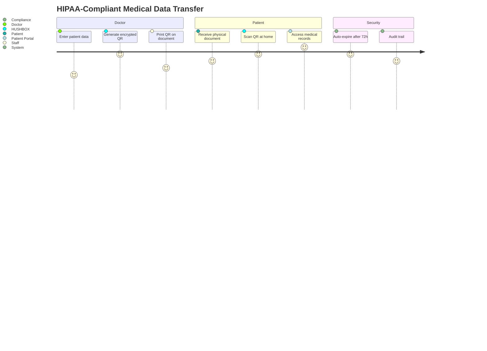

***Medical Use Case Features***
- **HIPAA Compliance**: End-to-end encrypted PHI (Protected Health Information)
- **Temporary Access**: Records auto-delete after set period
- **Access Control**: PIN-protected decryption
- **Emergency Access**: Break-glass mechanism for authorized personnel
- **Compliance Logging**: Tamper-proof access records

### 🔑 Enterprise Password Rotation

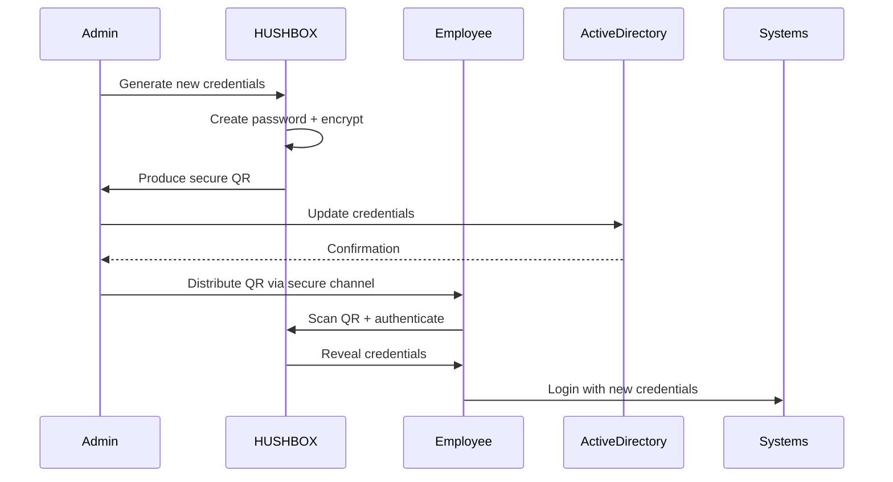

***Security Advantages***
- **No Plaintext Transmission**: Credentials never sent via email/chat
- **One-Time Use**: QR invalidates after first scan
- **Biometric Verification**: Optional face/fingerprint unlock
- **Usage Analytics**: Track credential distribution
- **Auto-Rotation**: Schedule regular password updates

### 🗝️ Diplomatic Communication

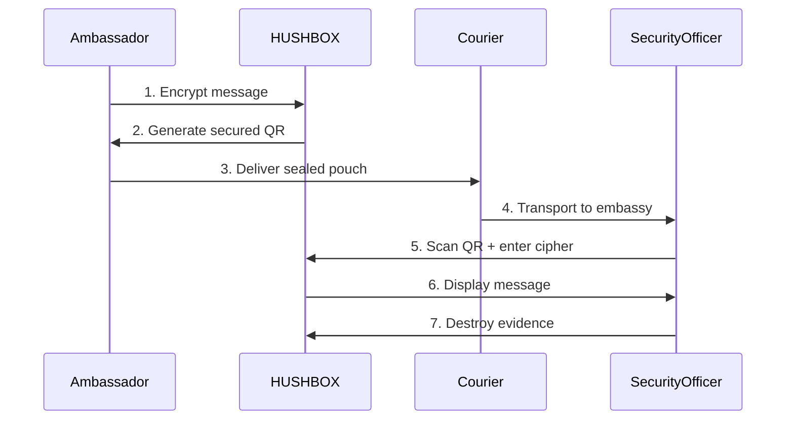

***Diplomatic Security Features***
- **Plausible Deniability**: Message appears as random data if intercepted
- **Duress Detection**: Hidden warning if decrypted under coercion
- **Multi-Party Auth**: Require 2 officers to decrypt
- **Geofencing**: Only decrypt in authorized locations
- **Ephemeral Storage**: Zero device persistence

### 🧪 Research Data Protection

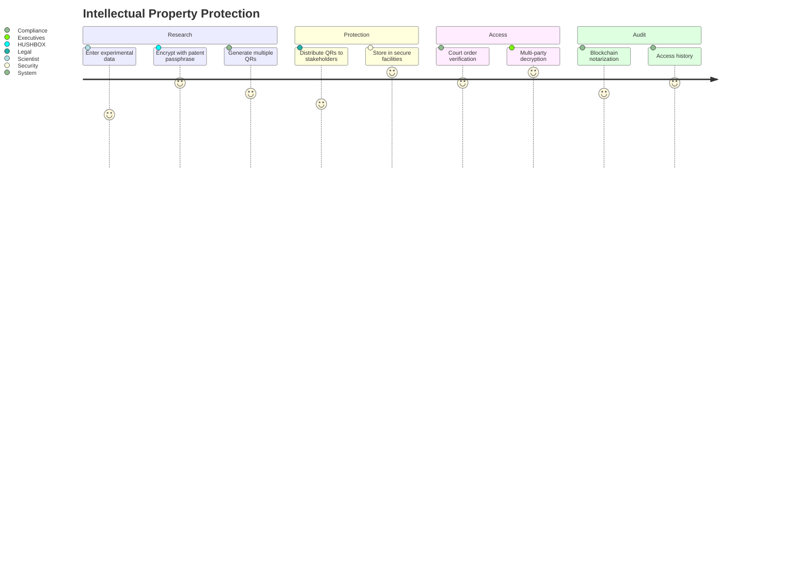

***Research Protection Features***
- **Patent-Safe Encryption**: Pre-filing data protection
- **Shamir's Secret Sharing**: Split across multiple QRs
- **Temporal Locks**: Decrypt only after specific date
- **Non-Repudiation**: Cryptographic proof of access
- **Data Inheritance**: Dead man's switch mechanism

## 🚨 Suggested Additional Workflows

### 1. Emergency Access System
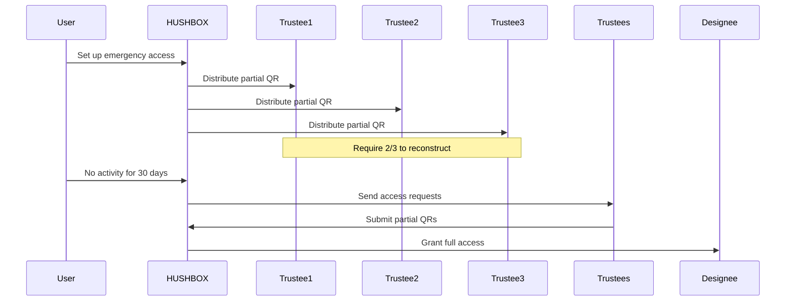

### 2. Notary Verification System
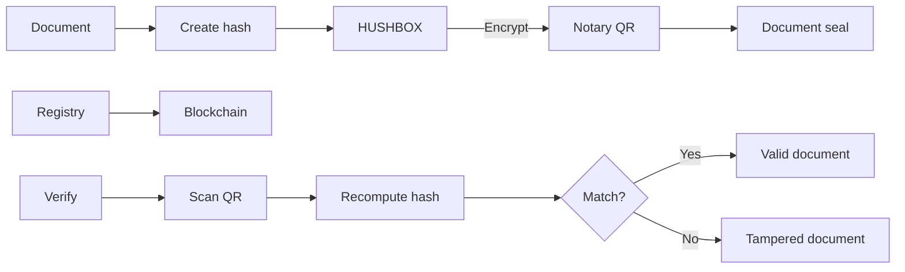

### 3. Digital Inheritance System
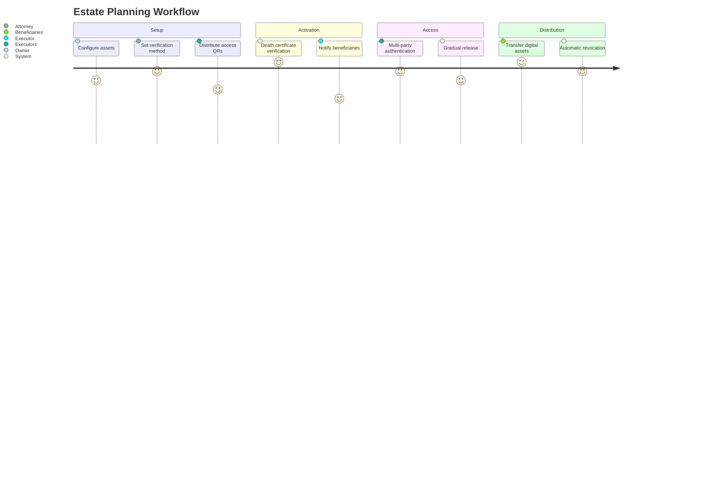

## 🛡️ Implementation Tips for All Workflows

1. **Physical Backup Best Practices**:
   - Use archival-quality paper or titanium plates
   - Laminate with UV-protective coating
   - Store in fireproof/waterproof containers
   - Create geographical distribution (multiple locations)

2. **Passphrase Management**:
   ```mermaid
   pie
       title Passphrase Storage Methods
       "Password Manager" : 45
       "Physical Vault" : 30
       "Memorization" : 15
       "Split Knowledge" : 10
   ```

3. **Security Verification Schedule**:
   - Monthly: Test decryption process
   - Quarterly: Rotate master passphrases
   - Annually: Replace physical backups
   - Biannually: Security audit penetration test

4. **Disaster Recovery**:
   - Maintain 3-2-1 backup rule:
     - 3 copies of QR
     - 2 different media types (paper/metal/digital)
     - 1 offsite location

These workflows demonstrate HUSHBOX's versatility across high-security scenarios. Each implementation maintains the core principles of zero-server architecture and client-side encryption while adapting to specific industry requirements.

---

## 🛡️ Security Specifications  

### Cryptography  
| Parameter | Value | Description |
|-----------|-------|-------------|
| Algorithm | AES-256-GCM | Authenticated encryption |
| Key Derivation | PBKDF2-HMAC-SHA256 | 310,000 iterations |
| Salt | 32 bytes | Unique per encryption |
| IV | 16 bytes | Cryptographic nonce |
| Compression | DEFLATE Level 6 | For messages >100 chars |

### Passphrase Requirements  
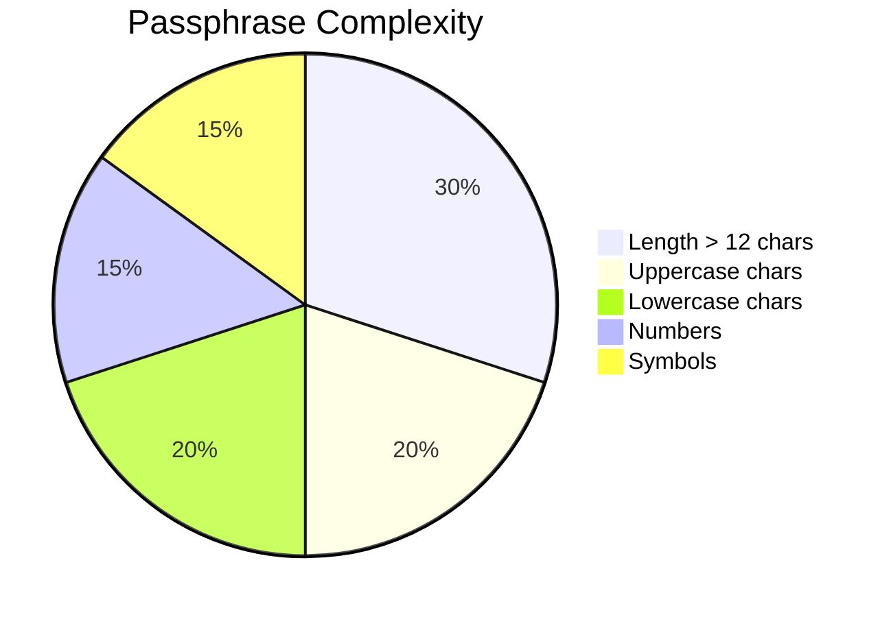

---

## 📈 Business Applications  

### Industry Solutions  
| Sector | Use Case |
|--------|----------|
| **Finance** | Secure earnings reports transmission |
| **Healthcare** | HIPAA-compliant patient data sharing |
| **Legal** | Confidential case document exchange |
| **Government** | Classified material distribution |
| **Manufacturing** | IP-protected blueprints sharing |

### Enterprise Benefits  
- **Zero Infrastructure Costs**: No servers to maintain  
- **Compliance Ready**: Meets GDPR/HIPAA requirements  
- **Employee Training**: <15 minute onboarding  
- **Security Certification**: HBX-SEC-2025-08 compliant   

---

## ⚠️ Security Best Practices  

### For All Users  
1. 🔑 Always use 15+ character passphrases  
2. 📲 Share passphrases via secure channels (Signal, ProtonMail)  
3. 🧹 Clear history after sensitive operations  
4. 🔒 Use in private browsing sessions or mode offline

### For Enterprises  
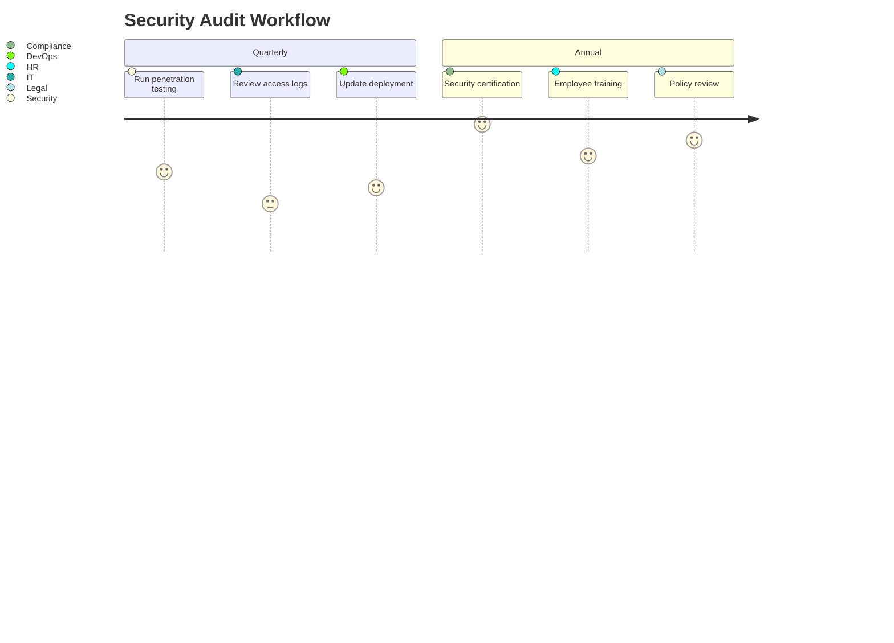
---

## 📜 License  
GNU AFFERO GENERAL PUBLIC LICENSE - [View License](https://github.com/MPetovick/HUSHBOX/blob/main/LICENSE)

## 🌐 Contact    
- **Community**: [Telegram](https://t.me/HUSHBOX_QR) | [Twitter](https://twitter.com/HUSHBOXonline)  
---

<div align="center">
  <br>
  <strong>Privacy That Never Leaves Your Hands</strong> ♾️🔐<br>
  <strong>Try HUSHBOX → </strong> <a href="https://www.hushbox.online">www.hushbox.online</a><br>
</div>
