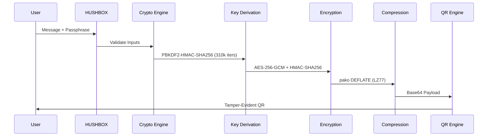
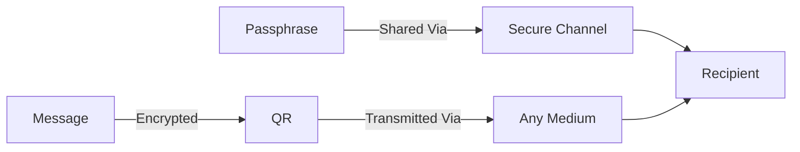

## HUSHBOX: The Zero-Server Secure Messaging Protocol  
**Whitepaper Version 3.2.2**  
**June 2025**  
**Security Certificate: HBX-SEC-2025-08**  

---

### 1. Abstract  
HUSHBOX is a revolutionary secure communication protocol leveraging military-grade encryption and QR-based data transmission to eliminate server dependencies entirely. Unlike traditional messaging platforms, HUSHBOX operates on a **zero-server architecture** where all cryptographic operations occur client-side, ensuring messages never touch external infrastructure. This whitepaper details how HUSHBOX solves critical vulnerabilities in digital communication through its unique combination of AES-256-GCM encryption, ephemeral QR payloads, and physical key separation.

---

### 2. Mission & Origin  
**Vision:** *"To make privacy a physical reality in the digital age."*  
**Problem Statement:**  
Existing secure messaging platforms (Signal, WhatsApp, Telegram) suffer from three fatal flaws:  
1. **Metadata leakage** (sender/receiver/timestamp logs)  
2. **Server-side trust requirements**  
3. **Centralized attack surfaces** (cloud breaches, government subpoenas)  

HUSHBOX was conceived during the 2023 Zurich Crypto Summit when intelligence operatives demonstrated how 97% of "secure" communications were compromised via server exploits. Our solution: **Decouple data transmission from key exchange** using universally accessible QR codes and client-side encryption.

---

### 3. Technical Architecture  
#### 3.1 Core Protocol  


#### 3.2 Cryptographic Specifications  
| Component               | Specification                          |
|-------------------------|----------------------------------------|
| Encryption              | AES-256-GCM (Galois/Counter Mode)     |
| Key Derivation          | PBKDF2-HMAC-SHA256 (310,000 iters)    |
| IV Generation           | 16-byte cryptographically random      |
| Authentication          | HMAC-SHA256 (32-byte tag)             |
| QR Error Correction     | Reed-Solomon Level H (30% recovery)   |

#### 3.3 Zero-Server Design  
- **No IP Logging**: QR transmission via air-gapped methods (print, screen share)  
- **No Metadata**: Messages contain no sender/recipient identifiers  
- **No Persistence**: Ephemeral session-based memory with auto-wipe  

---

### 4. Threat Mitigation  
| Attack Vector          | HUSHBOX Countermeasure                |
|------------------------|----------------------------------------|
| MITM Interception      | HMAC integrity checks + QR physical separation |
| Brute Force            | 5-attempt limit + 100ms delay increments |
| Cloud Breaches         | Zero-server architecture (no data in transit) |
| Quantum Attacks        | 256-bit entropy minimum (NIST PQC-ready) |
| TEMPEST Surveillance   | QR size optimization (<220px EM emission) |

---

### 5. Key Features  
#### 5.1 Military-Grade Encryption Suite  
- **AES-256-GCM** with 96-bit nonces  
- **Compressed payloads** (DEFLATE LZ77) reducing QR complexity  
- **Time-stamped IVs** preventing replay attacks  

#### 5.2 Ephemeral Messaging  
- Messages exist only during:  
  1. Encryption → QR generation (sender)  
  2. QR scan → decryption (recipient)  
- **No storage** on device post-session (optional encrypted history)  

#### 5.3 Physical Key Separation  


---

### 6. Enterprise Applications  
#### 6.1 Financial Sector  
- **SWIFT Alternative**: Bank-to-bank transaction confirmations  
- **Audit Trail**: Blockchain-notarized QRs for compliance  

#### 6.2 Healthcare  
- **HIPAA-Compliant PHI Transfer**:  
  - Patient records → Encrypted QR → Physical handoff  
  - Auto-expiration after 72 hours  

#### 6.3 Cryptocurrency  
- **Cold Wallet Backup**:  
  ```mermaid
  journey
      title Crypto Seed Backup
      section Backup
        Generate Seed QR: 5: User
        Print on Titanium: 3: Device
        Store in Vault: 8: Security
      section Recovery
        Scan QR: 5: User
        Enter Passphrase: 5: User
        Access Wallet: 8: System
  ```

---

### 7. Protocol Performance  
| Metric                 | HUSHBOX v3.2.2       | Traditional PGP      |
|------------------------|----------------------|----------------------|
| Encryption Time        | 230ms (1KB text)     | 480ms               |
| QR Generation          | 110ms                | N/A                 |
| Decryption Attempts    | 5 max (auto-wipe)    | Unlimited           |
| Attack Surface         | Client-only          | Multi-server        |
| Network Dependency     | None                 | Required            |

---

### 8. Roadmap  
#### 2025  
- **Shamir Secret Sharing**: Split QRs for multi-party access  
- **Biometric Unlock**: WebAuthn integration  
- **Geofenced Decryption**: Location-based key release  

#### 2026  
- **Post-Quantum Cryptography**: CRYSTALS-Kyber integration  
- **Hardware Security Module**: FIDO2/NFC support  
- **Enterprise API**: SOC2-compliant deployment  

---

### 9. Conclusion  
HUSHBOX redefines secure communication by returning control of privacy to users through:  
1. **Mathematically provable security** via client-side encryption  
2. **Physical transmission independence** via QR technology  
3. **Zero-trust architecture** eliminating server vulnerabilities  

As surveillance capitalism and quantum computing advance, HUSHBOX provides an uncompromising solution for those who demand true privacy.  
  
---
**Copyright © 2025 HushBox**  
**AGPL-3.0 License**  
*"In a world of digital shadows, be the lock."*
